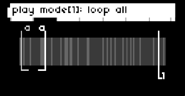
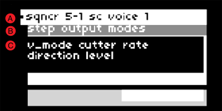

# splnkr
an amplitude and frequency tracking effects processor/sampler/sequencer for monome norns with a set of 16 grid-controlled bandpass filters. 

*IMPORTANT WARNING*: animating the bandpass filters with the grid interface can result in loud percussive sounds. use caution!

## requirements

* norns
* 16-column grid (required for sequencing)

## installation from maiden
`;install https://github.com/jaseknighter/splnkr`

(restart after installing)

## norns ui: key/encoder controls

### page 1: initial view
* all screens
  * e1: previous page 
  * e2: next/prev control screen
* screen 1: select/scrub sample/voice
  * k2: select audio sample

### page 1: sample selector/cutter (after sample is loaded)
* all screens
  * e1: previous page 
  * e2: next/prev control screen
  * k1 + k2: stop/start selected voice
  * k1 + k3: show instructions
* screen 1: select/scrub sample/voice
  * k2: select audio sample
  * e3: select playhead
  * k1 + e3: scrub playhead
* screen 2: play mode
  * k1 + k2: delete cutter
  * e3: set play mode selected cutter
  * k1 + e3: set play mode all cutters
* screen 3: adjust cut ends
  * k1 + k2: delete cutter
  * k1 + e2: select end
  * k1 + e3: adjust end
  * k1 + e1: fine adjust end
  * e3: select cutter end
* screen 4: move cutter
  * k1 + k2: delete cutter
  * k1 + e2: select cutter
  * k1 + e3: move cutter
  * k1 + e1: fine move cutter
* screen 5: adjust rate
  * k1 + k2: delete cutter
  * e3: adjust selected playhead rate
  * k1 + e3: fine adjust selected playhead rate
* screen 6: adjust level
  * k1 + k2: delete cutter
  * e3: adjust selected playhead level
  * e3: adjust all playhead levels
* screen 7: autogenerate cutters
  * e3: autogenerate clips by level (up to 20)
  * k1 + e3: autogenerate clips with even spacing (up to 20)

### page 2: live sample selector/cutter
* all screens
  * e1: previous page 
  * e2: next/prev control screen
  * k1 + k2: stop/start selected voice
  * k1 + k3: show instructions
* screen 1: select/scrub sample/voice
  * k2: select audio sample
  * e3: select playhead
  * k1 + e3: scrub playhead
* screen 2: play mode
  * k1 + k2: delete cutter
  * e3: set play mode selected cutter
  * k1 + e3: set play mode all cutters
* screen 3: adjust cut ends
  * k1 + k2: delete cutter
  * k1 + e2: select end
  * k1 + e3: adjust end
  * k1 + e1: fine adjust end
  * e3: select cutter end
* screen 4: move cutter
  * k1 + k2: delete cutter
  * k1 + e2: select cutter
  * k1 + e3: move cutter
  * k1 + e1: fine move cutter
* screen 5: adjust rate
  * k1 + k2: delete cutter
  * e3: adjust selected playhead rate
  * k1 + e3: fine adjust selected playhead rate
* screen 6: adjust buffer length
  * k1 + k2: delete cutter
  * e3: adjust buffer length
  * k1 + e3: fine adjust selected buffer length
* screen 7: adjust levels: preservation/recording/input
  * k1 + k2: delete cutter
  * e3: adjust amount of recording to preserve with each pass of the playhead
  * k1 + e3: adjust recording level
  * k3: toggle the input levels between on (1db) and off (-infinity db)
* screen 8: adjust level
  * k1 + k2: delete cutter
  * e3: adjust selected playhead level
  * e3: adjust all playhead levels
* screen 9: autogenerate cutters
  * e3: autogenerate clips by level (up to 20)
  * k1 + e3: autogenerate clips with even spacing (up to 20)

### page 3: envelopes
* e1: previous/next page 
* k1 + e1: select active envelope  
* e2: select envelope control  
* e3: change envelope control value  
* k2/k3: delete/add envelope control point  
* k1 + k3: show instructions

##### envelope modulation
* k1+k3: show/hide env modulation menu
* k1+e1: select active envelope  
* k2: select control
* k3: change control value

### page 4: sequencer
* e1: previous/next page 
* k2: select sequence group
* k3: add/remove control item
* k2: nav up
* k3: nav down

## norns ui: pages

on all pages the first encoder (e1) switches between the script's 3 pages.

note: if a 16-column grid is not connected, the script's 3rd (sequencer) screen is disabled.

### page 1: recorded sample selector/cutter
the sample selector/cutter page controls a simple sample player/cutter with 1-3 voices. 

key terms: 

* *playhead*: there are 3 playheads that may be set independently to play through a loaded sample
* *cutter*: a slice of a loaded sample

sample controls available on all page 1 screens:
  * e2: next/prev control screen
  * k1 + k2: stop/start selected voice
  * k1 + k3: show instructions

#### screen 1: select/scrub sample/voice

with no sample loaded: 

<!--  -->

the script first loads with instructions to press k2 to select a sample. once a sample has been selected, e2 navigates to other page 1 screens. 

with sample loaded: 

<!--  -->

the banded graphic that appears once a sample has been loaded depicts amplitude (volume) changes in the sample. darker bands represent softer sounds and lighter bands represent louder sounds.

screen 1 controls:
  * k2: select a new sample to play 
  * k1 + e3: scrub the playhead 
  * e3: select the active voice

#### screen 2: play mode

<!--  -->

there are five play modes that can be set individually (e3) for each of the 3 playheads:

* *stop*: stops the selected playhead
* *loop all*: the selected playhead plays through the entire sequence
* *all cuts*: the selected playhead jumps from one cutter to the next (assuming multiple cutters have been generated on screen 6)
* *sel cut*: the selected playhead plays just the selected cutter
* *1-shot*: the selected playhead plays just the selected cutter one time

on this screen, k1 + e3 sets the play modes for all six playheads at once.

screen 2 controls:
  * k1 + k2: stop/start selected voice
  * e3: set the play mode of the selected cutter
  * k1 + e3: set the play mode of all cutters
  <!-- * k2/k3: delete/add cutter -->

#### screen 3: adjust cut ends

<!--  -->

the cutter(s) ends may be controlled on this screen.

screen 3 controls:
  <!-- * k2/k3: delete/add cutter -->
  * k1 + k2: stop/start sel voice
  * k1 + e2: select cutter
  * e3: select cutter end to adjust
  * k1 + e3: adjust selected cutter end
  * k1 + e1: fine adjust selected cutter end

#### screen 4: move cutter

<!--  -->

the location of the cutter(s) may be controlled on this screen.

screen 4 controls:
  <!-- * k2/k3: delete/add cutter -->
  * k1 + k2: stop/start sel voice
  * k1 + e2: select cutter
  * k1 + e3: adjust selected cutter location
  * k1 + e1: fine adjust selected cutter location

#### screen 5: adjust rate

<!--  -->

the rate of each playhead may be controlled on this screen.

screen 5 controls:
  <!-- * k2/k3: delete/add cutter -->
  * k1 + k2: stop/start sel voice
  * e3: adjust selected voice rate
  * k1 + e3: fine adjust selected voice rate

#### screen 6: adjust level

<!--  -->

the audio level of each playhead may be controlled on this screen.

screen 6 controls:
  <!-- * k2/k3: delete/add cutter -->
  * k1 + k2: stop/start sel voice
  * e3: adjust selected voice level
  * k1 + e3: adjust all voice levels

#### screen 7: autogenerate cutters

<!--  -->

cutters may be added and removed from this screen. 

if cutters are added with e3, each cutter is set at a point of the sample where a large change in levels has been detected (e.g. at the start/end of a sound). 

if cutters are added with k1 + e3, each cutter is evenly spaced.

screen 7 controls:
  * k1 + k2: stop/start sel voice
  * e3: autogenerate clips by level (up to 20)
  * k1 + e3: autogenerate clips with even spacing (up to 20)

### page 2: live sampling selector/cutter
the live sampling selector/cutter page controls a simple sample player/cutter with 1-3 voices. 

key terms: 

* *playhead*: there are 3 playheads that may be set independently to play through a loaded sample
* *cutter*: a slice of a live sample

sample controls available on all page 1 screens:
  * e2: next/prev control screen
  * k1 + k3: show instructions

#### screen 1: select/scrub sample/voice

<!--  -->

the banded graphic that appears once a sample has been loaded depicts amplitude (volume) changes in the sample. darker bands represent softer sounds and lighter bands represent louder sounds.

screen 1 controls:
  * k2: select a new sample to play 
  * k1 + e3: scrub the playhead 
  * e3: select the active voice

#### screen 2: play mode

<!--  -->

there are five play modes that can be set individually (e3) for each of the 3 playheads:

* *stop*: stops the selected playhead
* *loop all*: the selected playhead plays through the entire sequence
* *all cuts*: the selected playhead jumps from one cutter to the next (assuming multiple cutters have been generated on screen 6)
* *sel cut*: the selected playhead plays just the selected cutter
* *1-shot*: the selected playhead plays just the selected cutter one time

on this screen, k1 + e3 sets the play modes for all six playheads at once.

screen 2 controls:
  * k1 + k2: stop/start selected voice
  * e3: set the play mode of the selected cutter
  * k1 + e3: set the play mode of all cutters
  <!-- * k2/k3: delete/add cutter -->

#### screen 3: adjust cut ends

<!--  -->

the cutter(s) ends may be controlled on this screen.

screen 3 controls:
  <!-- * k2/k3: delete/add cutter -->
  * k1 + k2: stop/start sel voice
  * k1 + e2: select cutter
  * e3: select cutter end to adjust
  * k1 + e3: adjust selected cutter end
  * k1 + e1: fine adjust selected cutter end

#### screen 4: move cutter

<!--  -->

the location of the cutter(s) may be controlled on this screen.

screen 4 controls:
  <!-- * k2/k3: delete/add cutter -->
  * k1 + k2: stop/start sel voice
  * k1 + e2: select cutter
  * k1 + e3: adjust selected cutter location
  * k1 + e1: fine adjust selected cutter location

#### screen 5: adjust rate

<!--  -->

the rate of each playhead may be controlled on this screen.

screen 5 controls:
  <!-- * k2/k3: delete/add cutter -->
  * k1 + k2: stop/start sel voice
  * e3: adjust selected voice rate
  * k1 + e3: fine adjust selected voice rate

#### screen 6: buffer length

the rate of each playhead may be controlled on this screen.

screen 6 controls:
  <!-- * k2/k3: delete/add cutter -->
  * k1 + k2: stop/start sel voice
  * e3: adjust selected voice's buffer rate
  * k1 + e3: fine adjust selected voice's buffer rate

#### screen 7: adjust levels: preservation/recording/input

three controls may be modified on this screen:
  * pre: the amount of live sampled audio that is preserved with each pass of a playhead
  * rec: the recording level
  * live: toggles the input levels between 1db and 0 (-infinite db)

screen 7 controls:
  <!-- * k2/k3: delete/add cutter -->
  * e3: adjust amount of recording to preserve with each pass of the playhead
  * k1 + e3: adjust recording level
  * k3: toggle the input levels between on (1db) and off (-infinity db)

#### screen 8: adjust level

<!--  -->

the audio level of each playhead may be controlled on this screen.

screen 8 controls:
  <!-- * k2/k3: delete/add cutter -->
  * k1 + k2: stop/start sel voice
  * e3: adjust selected voice level
  * k1 + e3: adjust all voice levels

#### screen 9: autogenerate cutters

<!--  -->

cutters may be added and removed from this screen. 

if cutters are added with e3, each cutter is set at a point of the sample where a large change in levels has been detected (e.g. at the start/end of a sound). 

if cutters are added with k1 + e3, each cutter is evenly spaced.

screen 9 controls:
  * k1 + k2: stop/start sel voice
  * e3: autogenerate clips by level (up to 20)
  * k1 + e3: autogenerate clips with even spacing (up to 20)

### page 3: envelopes

<!--  -->

the two shapes displayed on page 3 represent envelopes which may be applied to external devices (i.e. crow, jf, midi, w/). the first envelope is also be used to shape the granular envelope if enabled (see *effects* below for details). 

an extension of Mark Eats' [envgraph class](https://github.com/monome/norns/blob/main/lua/lib/envgraph.lua), the two envelopes may be set with a variable number of control points or *nodes*.

there are 5 types of controls for each of the two envelopes: 

*env level*: the maximum amplitude of the envelope  
*env length*: the length of the envelope  
*node time*: when the node is processed by the envelope  
*node level*: the amplitude of the envelope at the node time  
*node angle*: the shape of the ramp from the prior node time to the current node time

with a few exceptions, the last of the three control types (node time, node level, and node angle) are adjustable for each of envelopes nodes.

fine grain controls: all of the envelope controls allow for fine grain control using k1+e3.

#### envelope modulation

<!--  -->

pressing k1+k2 on the env screen brings up the *env modulation* menu. once enabled, the menu can be navigated using e2 and e3. each envelope has eight modulation parameters:  
  
* *mod prob*: The probability that one of the other modulation parameters will be evaluated. If it is set to 0%, no envelope modulation will occur for the selected envelope.  
* *time prob*: The probability that the time value for each of the envelope's nodes will be modulated.  
* *time mod amt*: The amount of modulation that will be applied to the time value of each of the envelope's nodes.  
* *level prob*: The probability that the level value for each of the envelope's nodes will be modulated.  
* *level mod amt*: The amount of modulation that will be applied to the level value of each of the envelope's nodes.  
* *curve prob*: The probability that the curve value for each of the envelope's nodes will be modulated.  
* *curve mod amt*: The amount of modulation that will be applied to the curve value of each of the envelope's nodes.  
* *env mod nav*: Selects which of the above seven parameters are selected on when env modulation is visible (by pressing k1+k3) on the env screen. This parameter is useful for controlling the env ui via midi. 

<!-- In addition, the *show env mod params* parameter makes the parameter modulation navigation visible (again, useful for controlling the ui via midi). -->

### page 4: sequencer

selecting the third page (*sqncr*) using norns encoder e1 brings up the sequencer view. this page is only available if a grid with 16 or more columns is attached to the norns.

by default, the sequencer has 9 steps. each sequence step has 5 sub-steps by default. values are assigned to the sequencer's sub-steps. each time the sequencer completes a cycle, the values assigned to the next sub-step are activated. 

*EXAMPLE*

if step 1 of the sequencer has a sample rate of 1 assigned to sub-step 1 and a sample rate of 2 assigned to sub-step 2: 

  * the first time the sequencer arrives at step 1 the sample rate will be set 1
  * after the sequencer has gone through all the active steps (9 steps by default) and returns to step 1, the 2nd sub-step will be activated and the sample rate will be set to 2

the sequencer is built around the [Lattice](http://norns.local/doc/modules/Lattice.html) and [Sequins](https://monome.org/docs/norns/reference/lib/sequins) libraries. 

#### sequencer grid controls

<!--  -->

* (1) *filter mode* selector (row 8, col 15): switches the grid to the bandpass filter control mode.
* (2) *sequencer mode* selector (row 8, col 16): switches the grid to the sequencer control mode.
  * note: using encoder e1 to select the norns sequencer view (page 3) will automatically switch the grid to the sequencer mode.
* (A) *sequence sets* (rows 1, cols 1-5): each sequence set defines a unique sequence of up to 9 sequence steps with each sequence step containing up to 5 sub-sequence values which are cycled as the sequencer completes its active steps (see *EXAMPLE* above)
* (B) *sequence steps* (rows 1, cols 6-14): each sequence set contains up to 9 steps. At each sequence step, multiple types of outputs may be sequenced.
  * the number of active sequence steps may be controlled from the params menu (PARAMETERS>EDIT>sequencing) by updating the *num steps* parameter.
* (C) *output types* (row 2, cols 6-14): there are 4 *output types*
    * recorded audio sample (recsamp): select to control the sample loaded on norns page 1
    * live audio sample (recsamp): select to control the sample loaded on norns page 2
    * devices (dev): select to control external devices
    * effects (eff): select to activate effects defined in the SuperCollider engine.
    * time: select to update values related to the sequencer's step and tempo parameters
* (D) *outputs* (row 3, cols 6-14)
  * each *output type* has multiple *outputs*:
    * recorded audio sample (recsamp): sequence a softcut voice for a recorded sample (up to 3 voices can be sequenced at each step)
    * live audio sample (livsamp): sequence a softcut voice for a live sample (up to 3 voices can be sequenced at each step)
    * devices (dev): there are 4 device outputs that may be selected: midi, crow, just friends, and w/
    * effects (eff): there are 6 effect outputs that may be selected:
      * amp (level): sets the level of the SuperCollider engine's audio output
      * drywet: sets the amount of audio signal sent to the SuperCollider engine to which effects will be applied
      * delay: sets a delay using SuperCollider's [BufCombC](https://doc.sccode.org/Classes/BufCombC.html) UGen
      * bitcrush: bitcrushes the audio signal with SuperCollider's [Decimator](https://doc.sccode.org/Classes/Decimator.html) UGen
      * granular enveloper (env): using live granulation with server-driven enveloping, based on example 1.b in the SuperCollider [Live Granulation tutorial](https://pustota.basislager.org/_/sc-help/Help/Tutorials/Live_Granulation.html)
        * note: the granular enveloper uses the envelope defined by the first envelope on the *splnkr* script's second page (env)
      * pitchshift (pshift): sets an arpeggiating pitchshifter using SuperCollider's time domain granular pitchshifter [PitchShift](https://doc.sccode.org/Classes/PitchShift.html) UGen.
    * time: there are 3 time outputs that may be selected
      * sequence
      * sub-sequence
      * clock/lattice/pattern (clp)assigned to each *sequence set*. 
    * time: sequence parameters related to time and the sequencer
* (E) *modes* (row 4, cols 6-14)
  * each *output* has multiple *modes*
    * *IMPORTANT NOTE* multiple modes may be active for each output at each sequence step
    * recorded audio sample (recsamp) voices 1-3
    * live audio sample (livesamp) voices 1-3
        * v_mode: the voice/playhead mode 
          <!-- * *stop*: stop the *voice*
          * *loop all*: loops through the whole sequence
          * *all cuts*: loop between active *cutters*
          * *sel cut*: loop within the *cutter* assigned to the *voice* -->
        * cutter: assign a cutter assigned to the selected voice
        * rate: the speed of the selected voice
        * direction: the direction of selected the voice
        * level: the amplitude of the selected voice
    * external devices (dev): 
      * midi: there are 7 modes for midi
        * v[1-3]: select up to 3 midi notes to play 
        * cc[1-3]: set up to 3 midi cc values 
        * stop/start: sends a stop/start signal to the selected midi output(s)
      * crow: there are 6 modes for crow
        * crow 1 pitch (c1_pitch): sets the pitch of crow output 1
        * crow 1 repeats (c1_rp): sets the number of times crow output 1 repeats the pitch
        * crow 1 repeat frequency (c1_rpfreq): sets the frequency at which crow output 1 repeats the pitch
        * crow 3 pitch (c3_pitch): sets the pitch of crow output 3
        * crow 3 repeats (c3_rp): sets the number of times crow output 3 repeats the pitch
        * crow 3 repeat frequency (c3_rpfreq): sets the frequency at which crow output 3 repeats the pitch
      * just friends (uses just friends' synthesis mode): there are 7 modes for just friends
        * play_note: sets the pitch of just friends using [dynamic voice allocation](https://github.com/whimsicalraps/Just-Friends/blob/main/Just-Type.md#dynamic-voice-allocation-6-voice-polysynth)
        * vce[1-6]: sets the pitch of the specified just friends channel using [individual voice control](https://github.com/whimsicalraps/Just-Friends/blob/main/Just-Type.md#individual-voice-control-6-monosynth-voices)
      * w/: there are 5 w/ modes
        * wsyn[1-3]: selects a wsyn voice to play
        * wdel-ks: karplus-strong synthesis
        * wdel: set delay parameters
    * effects (eff): 
      * delay: 
        * amount (amt): sets the amount of audio signal to send to the delay effect
        * delay time (del_time)
        * delay decay (del_decay)
        * delay amp (del_am)
      * bitcrush:
        * amount (amt): sets the amount of audio signal to send to the bitcrusher effect
        * bits: bit depth that the signal will be reduced to
        * rate:  the sample rate that the signal will be resampled at
      * granular enveloper (env):
        * off/on (off_on)
        * rate
        * overlap (ovrlap)
      * pitchshift (pshift):
        * amount (amt): sets the amount of audio signal to send to the bitcrusher effect
        * rate
        * ps_1 - ps_5: sets the amount to shift the pitch at each step of the 5-step arpeggio
        * note: there are two additional parameters that may be set in the PARAMETERS>EDIT menu that currently are not sequenced with the grid sequencer:
          * grain size
          * time dispersion
    * time: 
      * sequence: 
        * step: skip sequence steps according to the value set by the step parameter (a value of 1 doesn't result in skipped steps)
        * number of steps (#seq): sets the number of steps in the sequence
        * starting step: the step to start the sequence
      * sub-sequence: 
        * step: skip sub-sequence steps according to the value set by the step parameter (a value of 1 doesn't result in skipped steps)
        * number of steps (#seq): sets the number of steps in the sub-sequence
        * starting step: the step to start the sub-sequence
      * clock/lattice/pattern (clp):
        * clock: sets the norns clock speed
        * clock morph (c_morph): sets the speed and shape of a transition to a new clock speed
        * meter: sets the meter of the splnkr script
        * division: sets the division of the selected sequence set 
* (F) *params* (row 5, cols 6-14)
  * some of output modes have multiple params that may be sequenced: 
    * external devices (dev): 
      * midi: 
        * v[1-3]: midi voices 1-3 each have 6 parameters that may be set
          * pitch: sets the pitch
          * repeats (rep): sets the number of times each pitch is repeated
          * repeat frequency (rep_frq): sets the frequency (i.e. speed) of each repeat
          * duration (dur): sets the duration of each note
          * velocity (vel): sets the velocity of each note
          * channel (chan): sets the channel used for each note
        * cc[1-3]: midi cc's 1-3 each have 3 parameters that may be set
          * control change (cc): the control change value
          * value (val): the value to send to the selected midi cc
          * channel (chan): the channel to use to send the cc value
      * just friends: there are two parameters that may be set for each just friends' mode:
        * pitch: the pitch
        * level: the level (amp)
      * w/: 
        * wsyn[1-3]: wsyn voices 1-3 each have 9 parameters that may be set:
          * pitch
          * velocity (vel)
          * curve (crv)
          * ramp (rmp)
          * fm index (fm_ix)
          * fm envelope (fm_env)
          * fm ratio (fm_rat)
          * lpg time (lpg_tme)
          * lpg symmetry (lpg_sym)
        * wdel-ks: there are 4 parameters that may be set for /w_del in karplus-strong mode
          * pitch
          * mix
          * feedback (fbk)
          * filter (flt)
        * wdel: there are 9 paramerter that may be set for /w_del in delay mode
          * mix
          * time (tme)
          * feedback (fbk)
          * filter (flt)
          * rate (rte)
          * frequency (frq)
          * mod rate (mod_rte)
          * mod amount (mod_amt)
          * freeze (frz)
* (G-L) number selection ui groups: 
  * (G) *integer place value* selectors: one or more integer place number selections (ones, tens, hundreds, thousands, etc.) may be applied to a sequencer value. integer place values are defined going from right to left from the *decimal point* button (*I*)
  * (H) *decimal point* indicator: this grid button separates *integer place value* selectors from *decimal place value* selectors. 
  * (I) *decimal place value* selectors: one or more decimal place number selections (tenths, hundredths, thousandths, etc.) may be assigned to a sequencer value. decimal place values are defined going from left to right from the *decimal point* button (*I*)
  * (J) *place value* selector: sets the place value. This value will be added to the other selected place values.
    * examples:
      * if the *decimal place value* is set to tenths and the first *place value* selector is selected, the place value will be set to 0.1. 
      * if the *integer place value* is set to ones and the third *place value* selector is selected, the place value will be set to 3.
  * (K) *number sequence mode* selector: 
    * the *number sequence mode* selector is set to *absolute* for each value by default (meaning, the value selected will be the value used, irrespective of the prior value).
    * if a number is set to a sequence mode of *relative*, its value is added to the previous value. 
  * (L) *polarity* selector: sets the value to positive or negative. the *polarity* selector is set to positive by default. the polarity selector only appear's does not appear for some numerical values
  * notes about number selection: 
    * number selection occurs by first selecting a place value (ui groups *G* and/or *H*) and then selecting a number (ui group *J*).   
    * if mulitple place values are set, they are added together. For example, if the *ones integer place value* is set to `5` and the *tenths integer place value* is set to `4`  
    * if a *decimal place* value or *integer place* value is set with a short press with nothing selected in the number row (*J*), the value is set to `0` at that place
    * if a *decimal place* value or *integer place* value is set with a long press and nothing selected in the number row (*J*), the value for the selected output/mode/param is set to nil and will be skipped
    * if a place value is set with a long press with a number selected in the number row (*J*), only the selected place value is used and other place values are cleared. 
* (K-L) note selection ui groups: 
  * (K) *note sequence mode* selector: 
    * there are two possible note sequence mode values: *absolute* and *relative* 
    * if the *number sequence mode* selector is set to *absolute*, the value selected will be the value used in the sequence, irrespective of the prior value.
    * if a note is set to a sequence mode of *relative*, its value is added to the previous value. 
    * the *number sequence mode* selector is set to *absolute* by default
  * (L) *octave* selector: shifts the note up/down octaves. the *octave* selector is set to 0 by default.
* (J) option/note/place value selection: depending on the configuration of the selected option/mode/param, this ui group is used to ether select from a list of options a place value or a note value. 
* (M) *sub-sequence* value selector: 
  * sets the value at each step of a five step sub-sequence based on the selections made UI groups G-L. 
  * sub-sequence values are set in sequential order, switching to a new set of sub-sequence values each time the main sequence completes its steps (9 by default).

##### grid navigation with norns ui
some navigation of the grid is also possible via the norns ui:

  * e2: highlight sequence set
  * e3: highlight next control set
  * k2: select previous control set
  * k3:
    * if a sequence set has been highlighted with e2, k3 selects the highlighted sequence set
    * otherwise, k3 select the next control set

##### clearing sequence data
* what data can be cleared:
  * all values set within a sequence set (row 1-5, column 1) 
  * all values set within a single a sequence step (rows 6-14, column 1)
  * all values set within a sub-sequence step (rows 6-10, row 8)
* to clear sequence data:
  * select the data element (sequence set, sequence step or sub-sequence step) you want to clear to activate it 
  * long press the key selected in the previous step and then release it

##### copy/paste sequence data
copy paste is available in a number of areas:

* sequence set: copy all the sequence/output settings from one sequence set to another
  * method #1:
    * press the key representing the source sequence set you want to copy from to active it
    * long press the key representing the target sequence set you want to copy to and release the key
  * method #2:
    * press the grid key representing the target sequence set (the sequence set you want to copy to) so it is activated (blinking). for example, to copy to the first sequence set, press grid key 1,1
    * again, press the grid key representing the target sequence set, this time holding the key down
    * with the target sequence set key pressed, also press the key representing the source sequence set you want to copy from
    * release the target sequence set key
* sequin: to copy from one sequin (sequence step) to another follow the directions for one of the two methods detailed above for sequence set copying

#### sequencer norns ui
page 3 of the norns ui shows the sequencer's state. 

<!--  -->

 the screenshot above shows the norns ui when a sequence step is being setup, prior to a sub-sequence step value being set.

LEGEND

* (A) *breadcrumbs*: displays the following details: *sequence set number, sequin number, output type, output, output mode, output param*
  * The breadcrumb in the screenshot above (*sqncr 5-1 sc voice 1*) indicates the following has been selected on the grid: 
    * sequence set: 5 
    * sequence step: 1 
    * output type: softcut
    * output: voice 1
* (B) *active ui group*: displays the currently selected ui group
  * The screenshot above shows the *output modes* ui group has been selected
* (C) *selection values*: displays the items available to select based on the active ui group 
  * in the example above, the values shown are the parameters available for the softcut output types (i.e., *v_mode, cutter, rate, direction, level*)

<!--  -->

  the screenshot above shows the values set for a given output/mode/param for a single sequin (sequence step) for a selected sequence set. 

LEGEND

  * (A) *breadcrumbs*: displays the following details: *sequence set number, sequin number, output type, output, output mode, output param*
    * The breadcrumb in the screenshot above (*sqncr 5-1 sc voice 1*) indicates the following has been selected on the grid: 
      * sequence set: 5 
      * sequence step: 6 
      * output type: softcut
      * output: voice 1
      * mod: rate
      * selected value: 5 (relative)
  * (B) *active ui group*: displays the currently selected ui group
    * The screenshot above shows the *output values* ui group has been selected
  * (C) *sequence step*: three rows of values are displayed on the right representing the current output value at each step of the sequence (going left to right, top to bottom). 
  * (D) *sub-sequence value*: at each step of a sequence, there is a five step sub-sequence implemented as sequins nested within sequins. 
  * (E) *selected output value*: represents the value currently selected. when a sub-sequence step is selected on the grid (columns 6-10, row 8), this selected output value is assigned to the selected sub-sequence step.
  

## filterbank

parameters for the 16 channel bandpass filterbank may be controlled via the params menu or using the grid.

there are three parameters for each of the filterbanks' 16 channels: 
* level (amp)
* reciprocal quality (rq)
* center frequency (cf)

### filterbank grid controls

LEGEND

*mode selectors*
(1) *filter mode* selector (row 8, col 15): switches the grid to the bandpass filter control mode.
(2) *sequencer mode* selector (row 8, col 16): switches the grid to the sequencer control mode. (note: using encoder e1 to select the norns sequencer view (page 3) will automatically switch the grid to the sequencer mode.)

*filterbank view selectors*
(3) *level view selector*
(4) *reciprocal quality (rq) view selector*: 
(5) *center frequency (cf) view selector*

(A) *parameter value selectors*
the top 7 buttons in each row of the grid are used to set the value of the parameters of the filterbank's 16 bandpass filters. if none of the top 7 buttons are lit in a grid column, the selected parameter (level, rq, or cf) of the bandpass filter at the selected slot is at its lowest value. if all 7 buttons lit in a column, the active parameter filter at the selected slot is at its highest value.

*animation controls*
(6) *horizontal animation*: pressing this button (column 5, row 8) sweeps the values of each channel to the left cycling the values around to the far right channel after the values pass by the far left channel. if lit, pressing the button again turns off the animation.
(7) *vertical animation*: pressing this button (column 6, row 8) sweeps the values of each channel to the upwards, cycling back to the channel's min value when the max value is reached. if lit, pressing the button again turns off the animation.

*parameter overlay*
(8) selecting button (column 8, row 8) overlays the values of all three filter parameters over one another, making it easier to see how they interact, especially with animation turned on.

## misc parameters
the controls covered in the section below are found in the PARAMETERS>EDIT menu. with a few exceptions, these are not controllable with the grid sequencer.

### data management 
the current state of screens 1 & 2 and the grid sequencer may be saved, loaded, and deleted from the *data management* sub-menu.

### record player
records the loaded audio sample. how the sample gets recorded depends on the `play mode` setting:
* *stop*: record the entire sample 
* *loop all*: record the entire sample 
* *all cuts*: record all sample areas set by cutters
* *sel cut*: record the sample area set by the selected cutter

*important note*: if *play mode* is set to `all cuts`, all *rate* settings must either be positive or negative. 

### scales, notes, and tempo
set scale mode, root note, meter, and divisions

### audio routing
unlike most other norn's scripts, the *splnkr* script changes how audio is internally routed. this was done so that softcut audio can be processed by SuperCollider which isn't the case with the default routing configuration. three routing options are provided in the params menu:
* *in+cut->eng*: sends audio in and softcut audio to the supercollider engine 
* *in->eng*: sends audio in to the supercollider engine 
* *cut->eng*: sends softcut audio to the supercollider engine 

when the *splnkr* script is unloaded (e.g. when loading a different script or restarting norns), the script will reset the routing to the norns default settings.

### amp/freq detection
the *splnkr* script's SuperCollider engine includes frequency and amplitude detection which can be set in the params menu to trigger midi notes and crow notes/envelopes/gates/triggers. a number of options are provided to filter the frequency and amplitude (level) ranges sent to midi and crow. the notes sent to midi and crow can also be quantized to the values set in in SCALES, NOTES, AND TEMPO section of the params menu.

interesting feedback occurs when the source of audio that is routed to the SuperCollider engine from the norns audio in jacks (see *audio routing* above), is also being controlled with the *splnkr* script's amp/freq detection capabilities.

### inputs/outputs 
settings for midi, crow, jf, and w/ are avaiable in the params menu.

## credit and appreciation
* first and foremost, i'd like to thank [SPIKE the Percussionist](http://manipulate.net/) for the tremendous amount of testing, feedback, and encouragement he provided as i endeavored to get splnkr ready to publish
* this project was inspired by the [lines discussion](https://llllllll.co/t/re-deconstructing-jan-jelineks-zwischen/46577/4) about Jan Jelinek’s album “Zwischen” initiated by [Matt Lowery](https://www.instagram.com/mattlowery/?hl=en). it was out of my conversation with Matt  that  the basic conceptual framework for the script was formed.
* crossfading and audio routing code is based on the [stonesoup](https://github.com/schollz/stonesoup) script and [excellent sampler tutorial](https://schollz.com/blog/sampler/) by @infinitedigits
* additional heartfelt appreciation is oriented in the directions of :
  * @catfact 
  * @markeats for [Passerby](https://github.com/markwheeler/passersby)
  * @tyleretters for [Goldeneye](https://llllllll.co/t/goldeneye-now-gridless/46556), [Dronecaster](https://llllllll.co/t/34737), and [Arcologies](https://llllllll.co/t/35752)
  * @dan_derks for [Cheat Codes 2](https://llllllll.co/t/38414)
