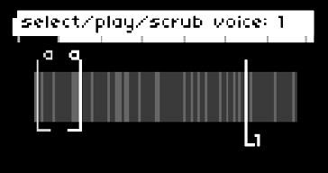
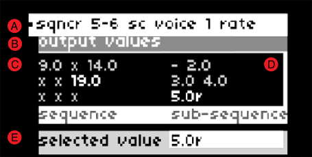

# splnkr
an amplitude and frequency tracking effects processor/sampler/sequencer for monome norns with a set of 16 grid-controlled bandpass filters. 

*IMPORTANT WARNING*: animating the bandpass filters with the grid interface can result in loud percussive sounds. use caution!

## requirements

* norns
* 16-column grid (required for sequencing)

## installation from maiden
`;install https://github.com/jaseknighter/splnkr`

(restart after installing)

## norns ui: key/encoder controls

### page 1: initial view
* all screens
  * e1: previous page 
  * e2: next/prev control screen
* screen 1: select/scrub sample/voice
  * k2: select audio sample

### page 1: sample selector/cutter (after sample is loaded)
* all screens
  * e1: previous page 
  * e2: next/prev control screen
  * k1 + k2: stop/start selected voice
  * k1 + k3: show instructions
* screen 1: select/scrub sample/voice
  * k2: select audio sample
  * e3: select playhead
  * k1 + e3: scrub playhead
* screen 2: play mode
  <!-- * k2/k3: delete/add cutter -->
  * e3: set play mode selected cutter
  * k1 + e3: set play mode all cutters
* screen 3: adjust cut ends
  <!-- * k2/k3: delete/add cutter -->
  * k1 + e2: select end
  * k1 + e3: adjust end
  * k1 + e1: fine adjust end
  * e3: select cutter end
* screen 4: move cutter
  <!-- * k2/k3: delete/add cutter -->
  * k1 + e2: select cutter
  * k1 + e3: move cutter
  * k1 + e1: fine move cutter
* screen 5: adjust rate
  <!-- * k2/k3: delete/add cutter -->
  * e3: adjust selected playhead rate
  * k1 + e3: fine adjust selected playhead rate
* screen 6: adjust level
  <!-- * k2/k3: delete/add cutter -->
  * e3: adjust selected playhead level
  * e3: adjust all playhead levels
* screen 7: autogenerate cutters
  * e3: autogenerate clips by level (up to 20)
  * k1 + e3: autogenerate clips with even spacing (up to 20)

### page 2: envelopes
* e1: previous/next page 
* k1 + e1: select active envelope  
* e2: select envelope control  
* e3: change envelope control value  
* k2/k3: delete/add envelope control point  
* k1 + k3: show instructions

##### envelope modulation
* k1+k3: show/hide plow modulation menu
* k1+e1: select active envelope  
* k2: select control
* k3: change control value

### page 3: sequencer
* e1: previous/next page 
* k2: select sequence group
* k3: add/remove control item
* k2: nav up
* k3: nav down

## norns ui: pages

on all pages the first encoder (e1) switches between the script's 3 pages.

note: if a 16-column grid is not connected, the script's 3rd (sequencer) screen is disabled.

### page 1: sample selector/cutter
the sample selector/cutter page controls a simple sample player/cutter with 1-6 voices. 

key terms: 

* *playhead*: there are 6 playheads that may be set independently to play through a loaded sample
* *cutter*: a slice of a loaded sample

sample controls available on all page 1 screens:
  * e2: next/prev control screen
  * k1 + k2: stop/start selected voice
  * k1 + k3: show instructions

#### screen 1 controls: select/scrub sample/voice

with no sample loaded: 

<!--  -->

the script first loads with instructions to press k2 to select a sample. once a sample has been selected, e2 navigates to other page 1 screens. 

with sample loaded: 

<!--  -->

the banded graphic that appears once a sample has been loaded depicts amplitude (volume) changes in the sample. darker bands represent softer sounds and lighter bands represent louder sounds.

screen 1 controls:
  * k2: select a new sample to play 
  * k1 + e3: scrub the playhead 
  * e3: select the active voice

#### screen 2 controls: play mode

<!--  -->

there are five play modes that can be set individually (e3) for each of the 6 playheads:

* *stop*: stops the selected playhead
* *loop all*: the selected playhead plays through the entire sequence
* *all cuts*: the selected playhead jumps from one cutter to the next (assuming multiple cutters have been generated on screen 6)
* *sel cut*: the selected playhead plays just the selected cutter
* *1-shot*: the selected playhead plays just the selected cutter one time

on this screen, k1 + e3 sets the play modes for all six playheads at once.

screen 2 controls:
  * k1 + k2: stop/start sel voice
  * e3: set the play mode of the selected cutter
  * k1 + e3: set the play mode of all cutters
  <!-- * k2/k3: delete/add cutter -->

#### screen 3 controls: adjust cut ends

<!--  -->

the cutter(s) ends may be controlled on this screen.

screen 3 controls:
  <!-- * k2/k3: delete/add cutter -->
  * k1 + k2: stop/start sel voice
  * k1 + e2: select cutter
  * e3: select cutter end to adjust
  * k1 + e3: adjust selected cutter end
  * k1 + e1: fine adjust selected cutter end

#### screen 4 controls: move cutter

<!--  -->

the location of the cutter(s) may be controlled on this screen.

screen 4 controls:
  <!-- * k2/k3: delete/add cutter -->
  * k1 + k2: stop/start sel voice
  * k1 + e2: select cutter
  * k1 + e3: adjust selected cutter location
  * k1 + e1: fine adjust selected cutter location

#### screen 5 controls: adjust rate

<!--  -->

the rate of each playhead may be controlled on this screen.

screen 5 controls:
  <!-- * k2/k3: delete/add cutter -->
  * k1 + k2: stop/start sel voice
  * e3: adjust selected voice rate
  * k1 + e3: fine adjust selected voice rate

#### screen 6 controls: adjust level

the audio level of each playhead may be controlled on this screen.

screen 6 controls:
  <!-- * k2/k3: delete/add cutter -->
  * k1 + k2: stop/start sel voice
  * e3: adjust selected voice level
  * k1 + e3: adjust all voice levels

#### screen 7 controls: autogenerate cutters

<!--  -->

cutters may be added and removed from this screen. 

if cutters are added with e3, each cutter is set at a point of the sample where a large change in levels has been detected (e.g. at the start/end of a sound). 

if cutters are added with k1 + e3, each cutter is evenly spaced.

screen 7 controls:
  * k1 + k2: stop/start sel voice
  * e3: autogenerate clips by level (up to 20)
  * k1 + e3: autogenerate clips with even spacing (up to 20)

### page 2: envelopes

<!--  -->

the two shapes displayed on page 2 represent envelopes which may be applied to external devices (i.e. crow, jf, midi, w/). the first envelope is also be used to shape the granular envelope if enabled (see *effects* below for details). 

an extension of Mark Eats' [envgraph class](https://github.com/monome/norns/blob/main/lua/lib/envgraph.lua), the two envelopes may be set with a variable number of control points or 'nodes.' 

there are 5 types of controls for each of the two envelopes: 

`env level`: the maximum amplitude of the envelope  
`env length`: the length of the envelope  
`node time`: when the node is processed by the envelope  
`node level`: the amplitude of the envelope at the node time  
`node angle`: the shape of the ramp from the prior node time to the current node time

with a few exceptions, the last of the three control types (node time, node level, and node angle) are adjustable for each of envelopes nodes.

fine grain controls: all of the envelope controls allow for fine grain control using k1+e3.

#### envelope modulation

<!--  -->

pressing k1+k2 on the plow screen brings up the `plow modulation` menu. once enabled, the menu, which can be navigated using e2 and e3. each envelope has eight modulation parameters:  
  
* `mod prob`: The probability that one of the other modulation parameters will be evaluated. If it is set to 0%, no envelope modulation will occur for the selected envelope.  
* `time prob`: The probability that the time value for each of the envelope's nodes will be modulated.  
* `time mod amt`: The amount of modulation that will be applied to the time value of each of the envelope's nodes.  
* `level prob`: The probability that the level value for each of the envelope's nodes will be modulated.  
* `level mod amt`: The amount of modulation that will be applied to the level value of each of the envelope's nodes.  
* `curve prob`: The probability that the curve value for each of the envelope's nodes will be modulated.  
* `curve mod amt`: The amount of modulation that will be applied to the curve value of each of the envelope's nodes.  
* `env mod nav`: Selects which of the above seven parameters are selected on when plow modulation is visible (by pressing k1+k3) on the plow screen. This parameter is useful for controlling the plow ui via midi. 

<!-- In addition, the `show env mod params` parameter makes the parameter modulation navigation visible (again, useful for controlling the ui via midi). -->

### page 3: sequencer

selecting the third page (*sqncr*) using norns encoder e1 brings up the sequencer view. this page is only available if a grid with 16 or more columns is attached to the norns.

by default, the sequencer has 9 steps. each sequence step has 5 sub-steps by default. values are assigned to the sequencer's sub-steps. each time the sequencer completes a cycle, the values assigned to the next sub-step are activated. 

*EXAMPLE*
if step 1 of the sequencer has a sample rate of 1 assigned to sub-step 1 and a sample rate of 2 assigned to sub-step 2: 

  * the first time the sequencer arrives at step 1 the sample rate will be set 1
  * after the sequencer has gone through all the active steps (9 steps by default) and returns to step 1, the 2nd sub-step will be activated and the sample rate will be set to 2

the sequencer is built around the [Lattice](http://norns.local/doc/modules/Lattice.html) and [Sequins](https://monome.org/docs/norns/reference/lib/sequins) libraries. 

#### grid controls

<!--  -->

* (1) *grid mode* selector: selecting grid key 15,8 switches the grid to the bandpass filter control mode
* (2) *sequencer mode* selector: selecting grid key 16,8 brings up the grid controls for the sequencer. 
  * note: using encoder e1 to select the norns sequencer view (page 3) will automatically switch the grid to the sequencer mode.
* (A) *sequence sets*: each sequence set defines a unique sequence of up to 9 sequence steps with each sequence step containing up to 5 sub-sequence values which are cycled as the sequencer completes its active steps (see *EXAMPLE* above)
* (B) *sequin(s)*: each sequence set contains up to 9 sequence steps defined with the Sequins port referenced above. At each sequence step, multiple types of outputs may be sequenced
  * the number of active steps may be controlled with from the params menu (PARAMETERS>EDIT>sequencing) by updating the *num steps* parameter
  * todo: allow each sequence set to have their own *num steps* step value
* (C) *output types*: at each step of the sequence, one or more *output types* may be selected. 
  * there are 4 *output types*
    * softcut (sc): 6 voice sampler
    * devices (dev): 4 devices are currently supported 
    * effects (eff): 6 effects are currently defined (see *outputs* below)
    * pattern (pat): each sequence set runs according to its own lattice pattern
    * lattice (lat): there is one lattice running that triggers the selected sequence set but each sequence set can individually control the lattice parameters
  * NOTE: currently, only settings for three output types are working so far: softcut, devices/crow, and devices/just friends. other *output types* (effects, w/, lattice, patterns) aren't yet working.
* (D) *outputs*
  * 3 of the 7 *output types* allow for multiple *outputs* to be sequenced:
    * softcut (sc): outputs 1-6 correspond to a softcut voice. 
    * devices (dev): midi, crow, just friends, w/
    * effects (eff): level, drywet, pitchshifter (pshift), p_offset, phaser, delay
* (E) *modes*
  * some of the *output types* and *outputs* have multiple *modes*:
    * dev/crow modes: *volts* and *drum*
    * dev/just friends modes: *play_note*, *play_voice*
    * dev/w/ modes: *w_syn pitch* and *w_del karplus pitch*
* (F) *params*
  * some of the *output types'* *outputs* and *modes* have multiple *params*: 
    * sc/voice[1-6] params: 
      * *voice_mode*: 
        * *stop*: stop the *voice*
        * *loop all*: loops through the whole sequence
        * *all cuts*: loop between active *cutters*
        * *sel cut*: loop within the *cutter* assigned to the *voice*
      * *cutter*: select the *cutter* assigned to the *voice*
      * *rate*: the speed of the *voice*
      * *direction*: the direction of the *voice*
      * *level*: the amplitude of the *voice*
    * *dev*/*just friends* play_note and play_voice (channels 1-6) params: 
      * *pitch*
      * *level*
* (J) option/place value selection: depending on the configuration of the selected option/mode/param, this ui group is used to ether select from a list of options or a place value (see *number selection* ui groups below for details about place values). 
* note selection ui groups: 
  * (K) *note sequence mode* selector: if a note is set to a sequence mode of *relative*, its value is added to the previous value. the *number sequence mode* selector is set to *absolute* for each value by default (meaning, the value selected will be the value used, irrespective of the prior value).
  * (L) *octave* selector: shifts the note up/down octaves. the *octave* selector is set to 0 by default.

* number selection ui groups: 
  * (G) *decimal place value* selectors: one or more decimal place number selection may be assigned to a sequencer value. decimal place values are defined going from left to right from the *decimal point* button (*I*):
    * tenths, hundredths, thousandths, etc
  * (H) *integer place value* selectors: one or more integer place number selection may be assigned to a sequencer value. integer place values are defined going from right to left from the *decimal point* button (*I*):
    * ones, tens, hundres, thousands, etc.
  * (I) *decimal point* button: this button separates *integer place value* selectors from *decimal place value* selectors does nothing function
  * (J) *place value* selector: sets the place value. For example, if the *integer place value* is set to `3` and the *place value* selector is selected, the place value will be set to 0.3. This value will be added to the other selected place values (with exceptions noted below) 
    * note: if 
  * (K) *number sequence mode* selector: if a number is set to a sequence mode of *relative*, its value is added to the previous value. the *number sequence mode* selector is set to *absolute* for each value by default (meaning, the value selected will be the value used, irrespective of the prior value).
  * (L) *polarity* selector: sets the value to positive or negative. the *polarity* selector is set to positive by default.
  * (M) *sub-sequence* value selector: sets the value at each step of a five step sub-sequence based on the option selected with (UI group J) or the number selected (UI groups (G-L)). When a value is active within this five step sub-sequence, this value is used to set the value of the selected output/mode/param.
  * notes about number selection: 
    * number selection occurs by first selecting a place value (ui groups *G* and/or *H*) and then selecting a number (ui group *J*).   
    * if mulitple place values are set, they are added together. For example, if the *ones integer place value* is set to `5` and the *tenths integer place value* is set to `4`  
    * if a *decimal place* value or *integer place* value is set with a short press with nothing selected in the number row (*J*), the value is set to 0 at that place
    * if a *decimal place* value or *integer place* value is set with a long press and nothing selected in the number row (*J*), the value for the selected output/mode/param is set to nil and will be skipped
    * if a place value is set with a long press with a number selected in the number row (*J*), only the selected place value is used and other place values are cleared. 

##### grid navigation with norns ui
some navigation of the grid is also possible via the norns ui:

  * e2: highlight sequence set
  * e3: highlight next control set
  * k2: select previous control set
  * k3
    * if a sequence set has been highlighted with e2, select the highlighted set
    * otherwise, select the next control set

##### clear sequence data
* what data can be cleared:
  * a sequence set (row 1-5, column 1) 
  * a sequin (ie an individual sequence steps) (rows 6-14, column 1)
  * an individual value within a sub-sequence (rows 6-10, row 8)
* to clear sequence data:
  * select the data element (sequence set or sequin) you want to clear to activate it 
  * long press the key selected in the previous step and then release it
* to clear an indivdual value within a sub-sequence long press the sub-sequence key (i.e. a key in rows 6-10, row 8)

##### copy/paste sequence data
copy paste is available in a number of areas:

* sequence set: copy all the sequence/output settings from one sequence set to another
  * method #1:
    * press the key representing the source sequence set you want to copy from to active it
    * long press the key representing the target sequence set you want to copy to and release the key
  * method #2:
    * press the grid key representing the target sequence set (the sequence set you want to copy to) so it is activated (blinking). for example, to copy to the first sequence set, press grid key 1,1
    * again, press the grid key representing the target sequence set, this time holding the key down
    * with the target sequence set key pressed, also press the key representing the source sequence set you want to copy from
    * release the target sequence set key
* sequin: to copy from one sequin (sequence step) to another follow the directions for one of the two methods detailed above for sequence set copying

#### norns ui

<!--  -->

 the norns ui provides information about the sequencer's state. the screenshot above shows the norns ui when a sequence step is being setup, prior to a sub-step value being set.

LEGEND
* (A) *breadcrumbs*: displays the following details: *sequence set number, sequin number, output type, output, output mode, output param*
  * The breadcrumb in the screenshot above (*sqncr 5-1 sc voice 1*) indicates the following has been selected on the grid: *sequence set (5), sequence step (1), output type (softcut), output(voice 1)*
* (B) *active ui group*: displays the currently selected ui group
  * The screenshot above shows the *output modes* ui group has been selected
* (C) selection values: displays the values available based on the ui group selected 
  * in the example above, the values shown are the parameters available for the softcut output types (i.e., *v_mode, cutter, rate, direction, level*)

<!--  -->

  the screenshot above shows the values set for a given output/mode/param for a single sequin (sequence step) for a selected sequence set. 

LEGEND
  * (A) *breadcrumbs*: displays the following details: *sequence set number, sequin number, output type, output, output mode, output param*
    * The breadcrumb in the screenshot above (*sqncr 5-1 sc voice 1*) indicates the following has been selected on the grid: *sequence set (5), sequence step (1), output type (softcut), output(voice 1)*
  * (B) *active ui group*: displays the currently selected ui group
    * The screenshot above shows the *output modes* ui group has been selected
  * (C) sequence step: three rows of values are displayed on the right representing the current output value at each step of the sequence (going left to right, top to bottom). 
  * (D) sub-sequence values: at each step of a sequence, there is a five step sub-sequence implemented as sequins nested within sequins. 
  * (E) selected output value *E* represents the value currently selected with the grid. when a sub-sequence step is selected on the grid, this selected output value is assigned to the selected sub-sequence step.
  

## filterbank

parameters for the 16 channel filterbank may be controlled via the params menu or using the grid.

three parameters may be set for each of the filterbanks 16 channelsw: 
* channel level (amp)
* reciprocal quality (rq)
* center frequency (cf)

### filterbank grid controls

*parameter adjustment*
the top 7 buttons in each row indicate the intensity of the setting for the filterbank parameter. if none of the top 7 buttons are lit in one of the grid's 16 columns, the filter at the selected slot is at its lowest intensity. if all 7 buttons lit, the filter at the selected slot is at its highest intensity.

selecting a button that is already lit sets the parameter to its lowest value.

*toggling between parameters*
each of the three parameters listed above may be controled via the grid by toggling between first three buttons on the grid's bottom row.

*animation controls*
the 5th and 6th buttons on the grid's bottom row control animation options for each of the three filter channel parameters:

*button 5*: pressing this button sweeps the values of each channel to the left cycling the values around to the far right channel after the values pass by the far left channel. if lit, pressing the button again turns off the animation.
*button 6*: pressing this button sweeps the values of each channel to the upwards, cycling back to the channel's min value when the max value is reached. if lit, pressing the button again turns off the animation.

selecting a buttons 5 or 6 when they are already lit turns off the animation for the selected filter parameter

*parameter overlay*
selecting button 8 on the bottom row turns overlays the values of all three filter parameters over one another, making it easier to see how they interact with animation turned on.

## misc parameters
the controls covered in the section below are found in the PARAMETERS>EDIT menu. with a few exceptions, these controls are not controllable with the grid sequencer.

### record player
what gets recorded depends on the `play mode` setting:
* *stop*: record the entire sample 
* *loop all*: record the entire sample 
* *all cuts*: record all sample areas set by cutters
* *sel cut*: record the sample area set by the selected cutter

*important note*: if *play mode* is set to `all cuts`, all *rate* settings must either be positive or negative. 

### scales, notes, and tempo
options are provided here to set scale mode, root note, sequencer meter, and sequencer divisions

### audio routing
unline most other norn's scripts, the *splnkr* script changes how audio is internally routed. this was done so that softcut audio can be processed by SuperCollider which isn't the case with the default routing configuration. Three routing options are provided in the params menu:
* *in+cut->eng*: sends audio in and softcut audio to the supercollider engine 
* *in->eng*: sends audio in to the supercollider engine 
* *cut->eng*: sends audio in and softcut audio to the supercollider engine 

when the *splnkr* script is unloaded (e.g. when loading a different script or restarting the norns), the script will reset the routing to the norns default settings.

### amp/freq detection
the *splnkr* script's SuperCollider engine includes frequency and amplitude detection which can be set in the params menu to trigger midi notes and crow notes/envelopes/gates/triggers. a number of options are provided to filter the frequency and amplitude (level) ranges sent to midi and crow. the notes sent to midi and crow can also be quantized to the values set in in SCALES, NOTES, AND TEMPO section of the params menu.

interesting feedback occurs when the source of audio that is routed to the SuperCollider engine from the norns audio in jacks (see *audio routing* above), is also being controlled with the *splnkr* script's amp/freq detection capabilities.

### saving sequences 
sequence data may be saved in the *sequencing* sub-menu.

## effects
there are four main effects built into the *splnkr* script: delay, bitcrush, enveloper, and pitchshift. these may be controlled with the grid sequencer and in the params menu.

### delay
delay time, decay, and amp controls are provided. when delay is set to very small amounts, resonating sounds may occur (like karplus-strong)
### bitcrush
control the number of bits and bitcrush rate
### enveloper
the enveloper is a granular synthesis-based enveloper that uses the shape of the *splnkr* scripts first envelope (see *page 2: envelopes* above). this allows for shaping of whatever audio is routed to the SuperCollider engine (see *audio routing* above), including softcut audio samples. 

### outputs 

midi, crow, jf, and w/ outputs are avaiable in the params menu (lots of bugs here to sort out). 

*pitch/frequency tracking*

after the wet signal is sent to the SuperCollider engine's bandpass filters, pitch and amplitude is tracked and sent back to norns, which passes the info on to external devices (midi, crow, jf, w/) depending on their (buggy) settings  

## credits
* first and foremost, i'd like to thank [SPIKE the Percussionist](http://manipulate.net) for tremendous amount of testing, feedback, and encouragement he provided as i was working to get this script ready to publish.
* this project was inspired by the [lines discussion](https://llllllll.co/t/re-deconstructing-jan-jelineks-zwischen/46577/4) about Jan Jelinek’s album “Zwischen” initiated by [Matt Lowery](https://www.instagram.com/mattlowery/?hl=en). It was a series of discussions I had with Matt at the start of this project that helped form the basic conceptual framework for the script. 
* splnkr leverages the [stonesoup](https://github.com/schollz/stonesoup) script developed by @infinitedigits/@schollz
* additional inspirations and thanks are due to:
  * @catfact
  * @markeats/@markwheeler Passerby (https://github.com/markwheeler/passersby)
  * @tyleretters Dronecaster (https://llllllll.co/t/34737) and Arcologies (https://llllllll.co/t /35752)
  * @dan_derks Cheat Codes 2 (https://llllllll.co/t/38414)

